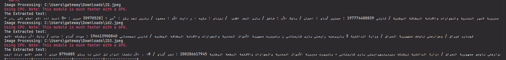
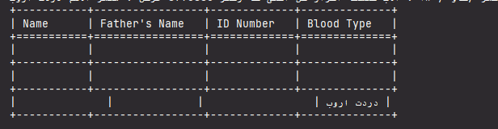

# OCRapplication
OCRapplication will process the ID card images and show the extracted information in tabular format.

This application is implemented to identify and extract text from images using Optical Character Recognition (OCR) technology and supports Arabic and English texts and numbers.

****_**Dependencies**:****_

To run this application, you need to have the following dependencies installed:

1. PyCharm 2022.1.2, Python 3.9
2. pandas
3. tabulate
4. regex (re)
5. easyocr
6. OpenCV

install those dependencies by:

`pip install pandas tabulate regex easyocr opencv-python
`

## **Usage**
* Clone or download the repository to your local machine.
* 
* Ensure that you have the required dependencies installed (see the Dependencies section above).
* 
* Place the photos of the ID cards you want to process in a directory accessible to the application.
* 
* Open a terminal or command prompt.
* 
* Navigate to the directory where you saved the application files.
* 
* Run the main.py script:  `python main.py`

The extracted text results:

The table form: 

## **Contributing**

Contributions to this project are welcome! Feel free to submit bug reports, feature requests, or pull requests on GitHub.
